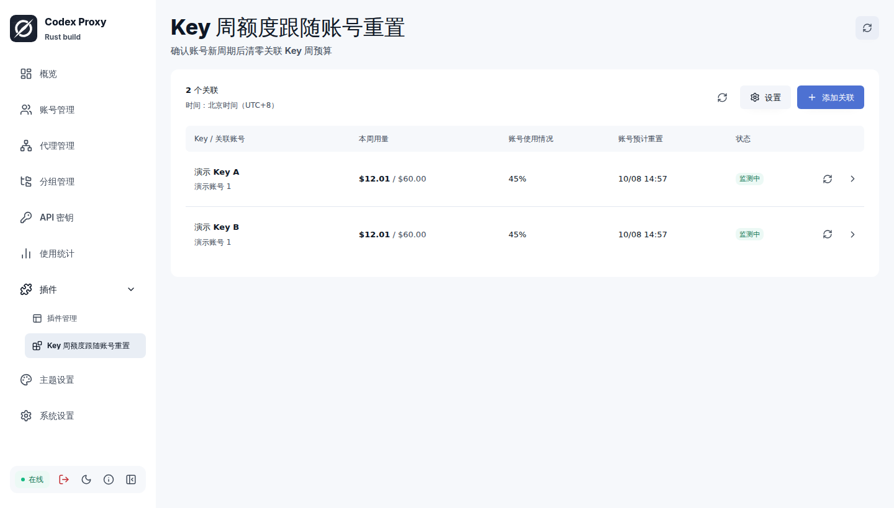
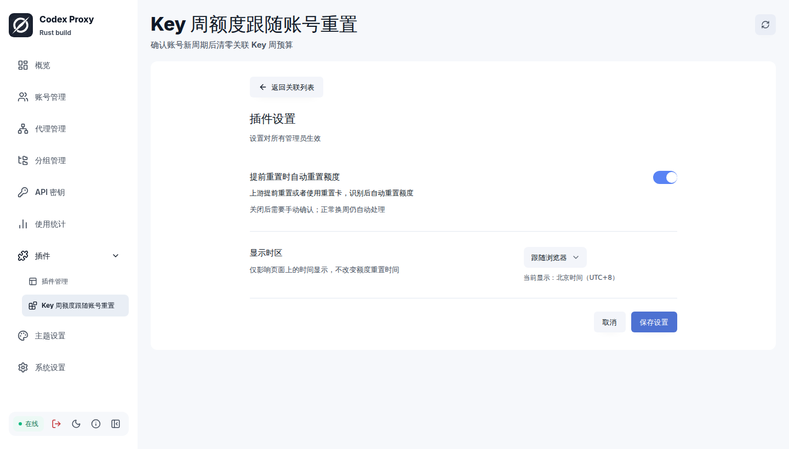

# Key 周额度跟随账号重置

[Codex Proxy RS](https://github.com/zyycn/codex-proxy-rs) 的独立插件，适合固定使用某个 Codex 账号的 Key。关联后，插件会跟随账号的周额度窗口，自动重置 Key 的本周用量，减少管理员逐个手动重置的维护负担。

一个账号可以关联多个 Key，各 Key 独立计费。正常换周自动处理；上游提前重置或使用重置卡后，也可自动跟随，或由管理员手动确认。

## 安装

支持 **官方 Codex Proxy RS v3.18.3 · Linux x86_64**。

1. 打开宿主的 **插件管理 → 安装插件 → GitHub**。
2. 仓库填写 `Ming-321/CPR-key-reset-follow`。版本标签留空即可查询最新正式版，无需勾选“允许查询预发行版”。
3. 点击“下一步”，选择 Linux x86_64 的 `.tar.gz` 附件，按提示完成安装并启用。
4. 打开插件页面，点击“添加关联”，选择现有 Key 和对应的 Codex 账号。

首次关联只记录当前周期，不清零。Key 应已通过宿主的分组与路由设置使用该账号；插件不会替你调整路由。

安装包和同名 `.sha256` 校验文件见 [Releases](https://github.com/Ming-321/CPR-key-reset-follow/releases)。也可以下载后在“上传包”中安装。

**从 beta 更新：** 打开插件详情，选择“手动安装版本”→ GitHub，清空旧的 beta 标签并取消“允许查询预发行版”，按提示保存来源、选择 `v0.1.0` 并更新。这样后续“检查更新”会查询稳定版；保留旧标签则仍会查询固定的 beta。原有关联、暂停状态、待处理记录和提前重置开关会保留，不需要删除插件或重新添加关联。新增时区设置默认为“跟随浏览器”。

## 使用

列表展示 Key 的本周用量、账号使用百分比、预计重置时间和当前状态。右上角“刷新”更新列表，行内“立即检查”会主动检查账号额度。

在“设置”中可调整：

- **提前重置时自动重置额度**：默认开启。上游提前重置或者使用重置卡，识别后自动重置额度；关闭后需要手动确认，正常换周仍自动处理。
- **显示时区**：跟随浏览器、北京时间或 UTC。选择对整个插件生效，仅影响时间显示。

需要处理时，点击对应行的“处理”。暂停、恢复和删除关联在详情中；恢复时重新记录当前周期，不补做暂停期间错过的重置。

## 使用前了解

- 账号重置后，上游可能要等到下一次使用才返回新周期。插件通常每 5 分钟检查一次，拿到有效信息后才处理，不靠使用率下降猜测重置。
- CPR 仍独立计算 Key 自身的周用量重置时间，可能比账号窗口早约 24 小时清零。插件不会让这两个时间完全对齐；Key 的这项时间可在详情查看。
- 如果清零结果无法确认，插件会停止自动重试。默认可保留现有用量并跳过；选择“再清零一次”可能清掉期间新增的消费，操作前需要明确确认。
- 停用或卸载可停止后续动作，已完成的清零无法撤销。

## 更多

[深色主题](docs/screenshots/dark.png) · [窄屏](docs/screenshots/narrow.png) · [添加关联](docs/screenshots/add.png) · [待确认](docs/screenshots/early.png) · [结果未知](docs/screenshots/unknown.png)

截图均来自官方宿主中的实际插件页面，使用合成数据。
开发、联调和发布见 [贡献指南](CONTRIBUTING.md)，周期判定与恢复规则见 [设计文档](docs/design.md)。

许可证：[Apache-2.0](LICENSE)
